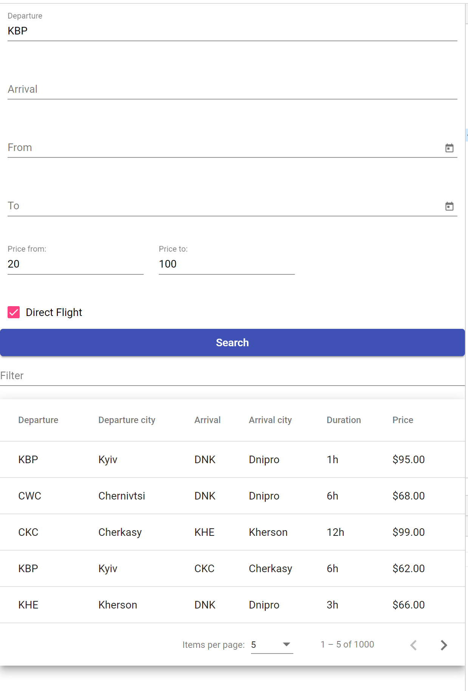
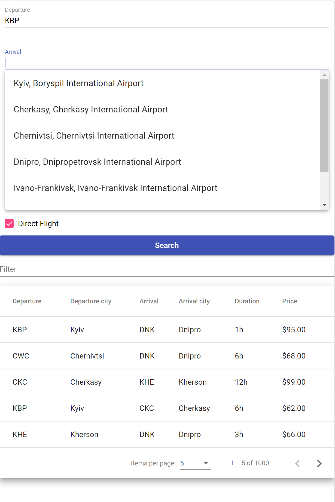

# Airline

This project was generated with [Angular CLI](https://github.com/angular/angular-cli) version 10.1.4.

National Airlines.
 - You can search for flights according to the following parameters separately or combine them together:
    - It will be possible to search for flights by a specific origin+destination.
    - You can search for flights on dates from a specific date to a specific date including.
 - You can select the number of connections made or a direct flight.
 - You can search for flights in a certain price range from minimum to maximum or give a maximum threshold that cannot be exceeded.
 - It will be possible to sort the flights by the length of the flight.
 - It will be possible to sort the flights by the number of stations (connections).


   

## Development server

Run `ng serve` for a dev server. Navigate to `http://localhost:4200/`. The app will automatically reload if you change any of the source files.

## Code scaffolding

Run `ng generate component component-name` to generate a new component. You can also use `ng generate directive|pipe|service|class|guard|interface|enum|module`.

## Build

Run `ng build` to build the project. The build artifacts will be stored in the `dist/` directory. Use the `--prod` flag for a production build.

## Running unit tests

Run `ng test` to execute the unit tests via [Karma](https://karma-runner.github.io).

## Running end-to-end tests

Run `ng e2e` to execute the end-to-end tests via [Protractor](http://www.protractortest.org/).

## Further help

To get more help on the Angular CLI use `ng help` or go check out the [Angular CLI README](https://github.com/angular/angular-cli/blob/master/README.md).
